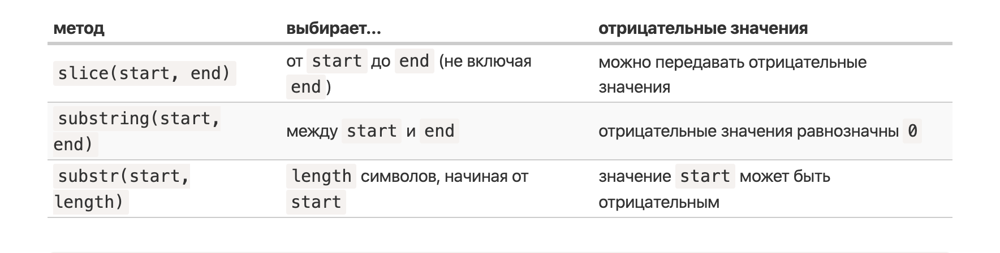

# Методы и свойства строк и массивов

Строки и массивы имеют встоенные методы

## Методы строк:

### Конкатенация строк:

Две символьные строки можно просто сложить

```
const greeting = "Hello"
const userName =  "Maksym"
console.log(greeting + userName)
```

- Плюсы: просто и понятно
- Минусы:

1. Нельзя использовать перенос строки или как это правильно называется многострочные литералы и строковую интерполяцию.
2. в примере выше у нас не будет пробела между этими строками, что бы это исправить нужно писать некрасиво:

```
const greeting = "Hello"
const userName = "Maksym"
console.log(greeting + ", " + userName)
```

или

```
const greeting = "Hello, "
const userName = "Maksym"
console.log(greeting + userName)
```

Шаблонные строки:

Синтаксис:
Записывается с помощью обратных кавычек
обьявляеться с помощью оператора "тильда" (кнопка над tab)
Если нужно вставить переменную используем: `${variableNameHere}`

Пример:

```
const greeting = "Hello"
const userName = "Maksym"

console.log(`${greeting}, ${userName}`)
```

### Длина строки:

```
const name = "Oleg"
name.length // 4
```

### Регист:

```
const string = "deEefkGeW"
string.toUpperCase()
string.toLowerCase()
```

## Поиск подстроки:

### indexOf

Этот метод позволяет найти подстроку в строке:

```
const string = "My new string"
string.indexOf("My") // 0
string.indexOf("new") // 3
string.indexOf("Bad word") // -1

```

### includes

Ищет подстоку если находит возвращает возвращает `true`, если нет - `false`

```
"Some string".includes("Some") // true
"Some string".includes("Hello") // false
```

### Получение подстроки:

- str.slice(start [, end])
- str.substring(start [, end])
- str.substr(start [, length])



## Манипуляции со строками:

### slice()

Разбивает строку на массив подстрок и возвращает массив

Исходная строка не изменяется

```
const str = "some string"
console.log(str.split (' '))

// ["some", "string"]

```

### trim()

Удаляет пробелы в начале и в конце строки

```
var str = "   Name   "
console.log(str.trim()) // "Name"
```

### repeat()

Возвращает новую сроку, содержащую заданное аргументом число копий исходной строки

```
var str = "repeat me! "
console.log(str.repeat(4))
```

### Сравнение строк:

1. Строчные буквы больше заглавных!

2. Строки кодируются в UTF-16 (https://ru.wikipedia.org/wiki/UTF-16). Таким образом, у любого символа есть соответствующий код. Есть специальные методы, позволяющие получить символ по его коду и наоборот.

# Методы массивов

### Свойство `length`

```
const arr = [1, 2, 3, 4, 5]
arr.length // 5
```

### pop()

Этот метод удаляет последний элемент массива и возвращает удаленный элемент

У метода нет параметров (аргументов)

```
const arr = [1, 2, 3, 4, 5]
const last = arr.pop()
console.log(last)
```

### push()

Этот метод добавляет новый элемент в конец массива

Аргументом, который получает метод при вызове, является добавляемый элемент

Метод возвращает новую длину массива

```
const arr = [1, 2, 3, 4, 5]
const newLength = arr.push(6)
console.log(newLength) // 6
```

### shift()

Этот метод удаляет первый элемент из массива

Возвращаемое значение - удаленный элемент

Например, в результате выполнения следующего кода:

```
const arr = [1, 2, 3, 4, 5]
const element = arr.shift()
console.log(element) // 1
```

### unshift()

Метод добавляет новый элемент в начало массива

Возвращаемое значение - новая длина массива
(число)

```
const arr = [1, 2, 3, 4, 5]
const newLength = arr.unshift(777)
console.log(newLength) // 6
console.log(arr)
```

### splice ()

Первый аргумент (число) определяет положение (индекс), куда будут вставлены новые элементы

Второй аргумент (число) определяет, сколько элементов (начиная с позиции вставки) должно быть удалено из массива

Третий (четвертый, пятый ...) аргументы - это элементы, которые нужно вставить в массив

Метод возвращает удаленные элементы массива (массив)

```
let myArray = [ 1, 2, 3, 4, 5 ]
console.log (myArray.splice (2, 1, "*" ))
// [ 1, 2, "*", 4, 5 ]
//  а в консоль будет выведено: [ 3 ]
//  ( массив элементов, которые были заменены на  "*" )
```

### slice ()

Метод создает новый массив, содержащий фрагмент исходного массива

При этом исходный массив не изменяется

Возвращаемое значение - новый массив, являющийся фрагментом исходного массива

Аргументы:

Первый (число) - индекс элемента исходного массива, с которого начинается фрагмент

Второй (число) - индекс элемента исходного массива, до которого продолжается фрагмент

```
const drinks = [ "кофе", "чай", "сок", "вода", "молоко" ]
const newDrinks = drinks.slice ( 1, 2 )
//  Значение newDrinks:  [ "чай" ]
```

### concat ()

Метод объединяет два или более массива в один массив

Возвращаемое значение - новый массив

Исходные массивы не изменятся

```
const ukrainianCities = [ "Киев", "Львов","Харьков", "Одесса" ]

const europeanCities = [ "Монреаль", "Копенгаген", "Вена", "Лондон" ]

const newArray = ukrainianCities.concat ( europeanCities )
```

### join ()

Объединяет все элементы массива в строку ( "string" )

Аргумент - символ-разделитель

## Деструктуризация

Деструктуризация - JavaScript выражение, позволяет извлекать данные из массивов и объектов в отдельные переменные

```
const x = [1, 2, 3, 4, 5];
const [y, z] = x;
console.log(y); // 1
console.log(z);
```

### Слияние массивов с помощью деструктуризации

```
const arr1 = [1, 2]
const arr2 = [3, 4]

[...arr1, ...arr2]
```
